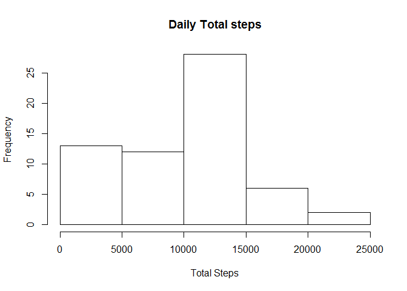
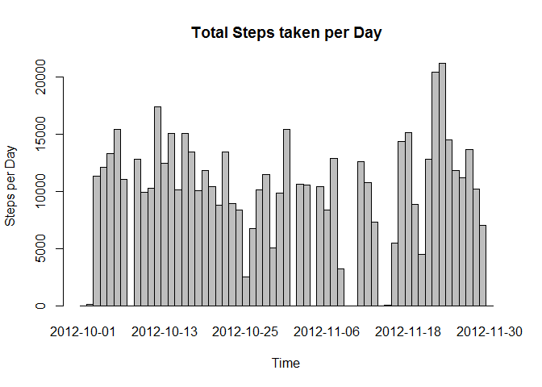
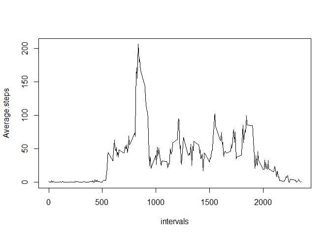
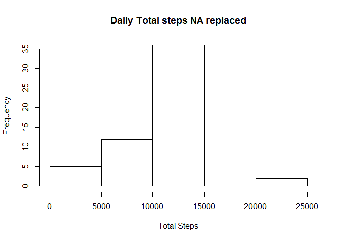
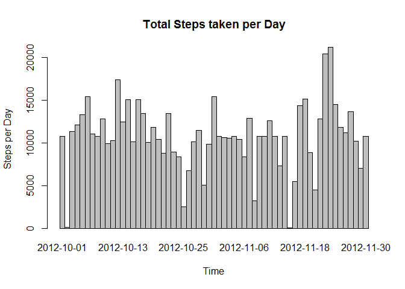
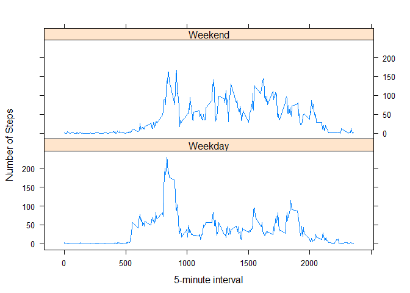

# Reproducible Research: Peer Assessment 1
Shobeir K. S. Mazinani  
January 4, 2016  


## Loading and preprocessing the data

Packages `dplyr` and `lubridate` are loaded to make cleaning and processing data easier.
In loading the `dplyr` package I am using the `suppressMessages` command to avoid seeing the dependency and warnings for aesthetic reasons.
The assumption is the dataset 'activity' is inside a folder called activity in your working directory.

```r
suppressMessages(library("dplyr"))
library("lubridate")
data <- read.csv(file = "activity/activity.csv")
data <- tbl_df(data)
```
The `date` column of the data is transformed into the *time* class by using `lubridate` package.

```r
data$date <- ymd(as.character(data$date))
data
```

```
## Source: local data frame [17,568 x 3]
## 
##    steps       date interval
##    (int)     (time)    (int)
## 1     NA 2012-10-01        0
## 2     NA 2012-10-01        5
## 3     NA 2012-10-01       10
## 4     NA 2012-10-01       15
## 5     NA 2012-10-01       20
## 6     NA 2012-10-01       25
## 7     NA 2012-10-01       30
## 8     NA 2012-10-01       35
## 9     NA 2012-10-01       40
## 10    NA 2012-10-01       45
## ..   ...        ...      ...
```

## What is mean total number of steps taken per day?
For this part of the analysis, the missing values in the dataset are ignored.

        Make a histogram of the total number of steps taken each day.
First, a column with the date as factor is added to the dataset by using `mutate` from `dplyr` package. Second, the data is `grouped_by` the date factor. Third, 

```r
data <- mutate(data,time_factor = as.factor(date))
data <- group_by(data,time_factor)
daily_total_steps <- summarize(data,sum(steps,na.rm = TRUE))
names(daily_total_steps) <- c("time","sum")
```
Here is the total number of steps per day.

```r
daily_total_steps
```

```
## Source: local data frame [61 x 2]
## 
##          time   sum
##        (fctr) (int)
## 1  2012-10-01     0
## 2  2012-10-02   126
## 3  2012-10-03 11352
## 4  2012-10-04 12116
## 5  2012-10-05 13294
## 6  2012-10-06 15420
## 7  2012-10-07 11015
## 8  2012-10-08     0
## 9  2012-10-09 12811
## 10 2012-10-10  9900
## ..        ...   ...
```
        If you do not understand the difference between a histogram and a barplot, research the difference between them. Make a histogram of the total number of steps taken each day.
Here is the `histogram`:

```r
hist(daily_total_steps$sum,main = "Daily Total steps",xlab = "Total Steps")
```

 

### Optional
I don't see the `histogram` to answer the question. I believe the `barplot` can be a better choice.

```r
barplot(
      height=daily_total_steps$sum,
      main="Total Steps taken per Day",
      xlab="Time",
      ylab="Steps per Day",
      names.arg=daily_total_steps$time,
      space=c(0)
    )
```

 

        Calculate and report the mean and median of the total number of steps taken per day.


```r
mean_daily_steps <- mean(daily_total_steps$sum)
median_daily_steps <- median(daily_total_steps$sum)
```

```r
print(mean_daily_steps)
```

```
## [1] 9354.23
```

```r
print(median_daily_steps)
```

```
## [1] 10395
```

## What is the average daily activity pattern?

        Make a time series plot (i.e. `type = "l"`) of the 5-minute interval (x-axis) and the average number of steps taken, averaged across all days (y-axis)

I interprate this as plotting a time series of the average number of steps in each interval. There are 288, 5 minutes intervals in a day.


```r
data <- group_by(data,interval)
averaged_int <- summarize(data,mean(steps,na.rm = TRUE))
names(averaged_int) <- c("intervals","Average.steps")
with(averaged_int,plot(intervals,Average.steps,type = "l"))
```

 

        Which 5-minute interval, on average across all the days in the dataset, contains the maximum number of steps?

We just have to print the Average.steps maximum.

```r
averaged_int[averaged_int$Average.steps == max(averaged_int$Average.steps,na.rm = TRUE),]
```

```
## Source: local data frame [1 x 2]
## 
##   intervals Average.steps
##       (int)         (dbl)
## 1       835      206.1698
```

Hence the $835^{th}$ interval has the maximum average number of steps that is **206**.

## Imputing missing values

Note that there are a number of days/intervals where there are missing values (coded as NA). The presence of missing days may introduce bias into some calculations or summaries of the data.

        Calculate and report the total number of missing values in the dataset (i.e. the total number of rows with NAs)

The easiest way to do this, is to look at the difference between the number of rows of the initial dataset and the rows without **NA**. This is achieved by using `complete.cases` command.


```r
nrow(data) - nrow(data[complete.cases(data),])
```

```
## [1] 2304
```

        Devise a strategy for filling in all of the missing values in the dataset. The strategy does not need to be sophisticated. For example, you could use the mean/median for that day, or the mean for that 5-minute interval, etc.
    
We replace the `NA` by the average (`mean`) of that particular interval. We also `round` the number to make it more meaningful as for the number os steps should be an integer.   

        Create a new dataset that is equal to the original dataset but with the missing data filled in.

    

```r
test <- merge(x = data,y = averaged_int,by.x = "interval",by.y = "intervals")
test1 <- mutate(test,new.steps = ifelse(is.na(steps),round(Average.steps),round(steps)))
rm(test)
test1 <- tbl_df(test1)
test1 <- select(test1, col = c(1,6,3,5))
names(test1) <- c("interval","steps.modified","date","average.interval")
test1 <- arrange(test1,date)
test1
```

```
## Source: local data frame [17,568 x 4]
## 
##    interval steps.modified       date average.interval
##       (int)          (dbl)     (time)            (dbl)
## 1         0              2 2012-10-01        1.7169811
## 2         5              0 2012-10-01        0.3396226
## 3        10              0 2012-10-01        0.1320755
## 4        15              0 2012-10-01        0.1509434
## 5        20              0 2012-10-01        0.0754717
## 6        25              2 2012-10-01        2.0943396
## 7        30              1 2012-10-01        0.5283019
## 8        35              1 2012-10-01        0.8679245
## 9        40              0 2012-10-01        0.0000000
## 10       45              1 2012-10-01        1.4716981
## ..      ...            ...        ...              ...
```

        Make a histogram of the total number of steps taken each day and Calculate and report the mean and median total number of steps taken per day. Do these values differ from the estimates from the first part of the assignment? What is the impact of imputing missing data on the estimates of the total daily number of steps?
        
The steps taken here are similar to the ones that were taken to create the first histogram (and the optional barplot).


```r
test1 <- group_by(test1,as.factor(date))
daily.total.steps <- summarize(test1,sum(steps.modified))
names(daily.total.steps) <- c("time","sum.modified")
hist(daily.total.steps$sum.modified,main = "Daily Total steps NA replaced",xlab = "Total Steps")
```

 

### Optional
I don't see the `histogram` to answer the question. I believe the `barplot` can be a better choice.

```r
barplot(
      height=daily.total.steps$sum.modified,
      main="Total Steps taken per Day",
      xlab="Time",
      ylab="Steps per Day",
      names.arg=daily.total.steps$time,
      space=c(0)
    )
```

 

```r
mean_daily_steps_modified <- mean(daily.total.steps$sum.modified)
median_daily_steps_modified <- median(daily.total.steps$sum.modified)
```

```r
print(mean_daily_steps_modified)
```

```
## [1] 10765.64
```

```r
print(median_daily_steps_modified)
```

```
## [1] 10762
```
The difference in the `mean` and `median` of the modified (NA replaced) and initial treatment (NA removed) is as following:


```r
print(((mean_daily_steps_modified - mean_daily_steps)/mean_daily_steps_modified)*100)
```

```
## [1] 13.11032
```

```r
print(((median_daily_steps_modified - median_daily_steps)/median_daily_steps_modified)*100)
```

```
## [1] 3.410147
```
We can see that clearly the change in the `mean` is a lot more considerable than `median`. Within the new approach `median` is relatively unchanged (~3%) wheras `mean` has changed by ~13% .

## Are there differences in activity patterns between weekdays and weekends?

        Create a new factor variable in the dataset with two levels - "weekday" and "weekend" indicating whether a given date is a weekday or weekend day.

By using the `wday` function from the `lubridate` package, we now assign the new factor to the new dataset called `test2`.


```r
test1 <- tbl_df(test1)
test2 <- mutate(test1,weekday = ifelse(wday(test1$date, abbr = TRUE,label = TRUE) %in% c("Sun","Sat"),"Weekend","Weekday"))
test2 <- group_by(test2,weekday)
```

        Make a panel plot containing a time series plot (i.e. type = "l") of the 5-minute interval (x-axis) and the average number of steps taken, averaged across all weekday days or weekend days (y-axis). 


```r
library(lattice)
test2 <- group_by(test2,weekday,interval)
test2 <- summarise(test2,mean(steps.modified))
names(test2) <- c("weekday","interval","mean.steps.modified")
with(test2,xyplot(mean.steps.modified~interval|weekday,layout = c(1,2),type = "l",xlab = "5-minute interval", ylab = "Number of Steps"))
```

 

It can be seen that there is a difference in the pattern of number of steps in weekdays versus weekends. It is clear that during the weekend there is a more distributed walking pattern.
